# Graphic filters (image_processor)

This project is a part of learning to code with C++. This is a console app to edit pictures in 24-bit [BMP](http://en.wikipedia.org/wiki/BMP_file_format) format.

*Attention! This .md page takes a while to load the example pictures from ./results folder .*

## Format of command line arguments

Description of the format of command line arguments:

`{program name} {path to input file} {path to output file}
[-{filter name 1} [filter parameter 1] [filter parameter 2] ...]
[-{filter name 2} [filter parameter 1] [filter parameter 2] ...] ...`

When running without arguments, the program outputs help.

### Example
This is our example image:

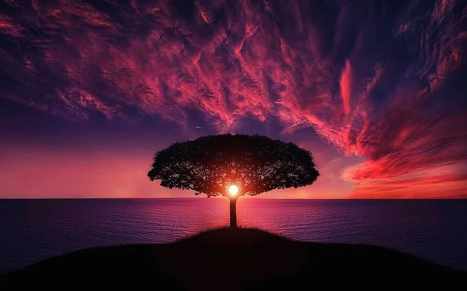

Let us apply these filters:

`./image_processor input.tmp /tmp/output.bmp -crystallize_advanced 2000 -blur 3`

In this example
1. The image is loaded from the file `input.bmp`
2. Advanced crystallize filter with 2000 random points is applied.
3. A blur with sigma 3 is applied
4. The resulting image is saved to the file `/tmp/output.bmp`

Our result here is following:


The filter list may be empty, then the image must be saved unchanged.
Filters are applied in the order in which they are listed in the command line arguments.

## Filters

In the formulas, we further assume that each color component
is represented by a real number from 0 to 1. Pixel colors
are represented by triples `(R, G, B)`. Thus, `(0, 0, 0)` – black, 
`(1, 1, 1)` – white.

### List of basic filters

#### [Matrix filter](filters/matrix_filter.cpp) (no user-usage due to it is inside component of the project)
If the filter is set by a matrix, it means that the value of each of the colors is determined by the weighted sum
of the values of this color in neighboring pixels in accordance with the matrix. In this case, the target pixel
corresponds to the central element of the matrix.

For example, for a filter given by a matrix


The value of each of the colors of the target pixel `C[x][y]` will be determined by the formula

```
C[x][y] =
  min(1, max(0,
   1*C[x-1][y-1] + 2*C[x][y-1] + 3*C[x+1][y-1] +
   4*C[x-1][y]   + 5*C[x][y]   + 6*C[x+1][y]   +
   7*C[x-1][y+1] + 8*C[x][y+1] + 9*C[x+1][y+1]
))
```

When processing pixels close to the edge of the image, part of the matrix may extend beyond the image boundary.
In this case, we will use the value of the image pixel closest to it as the value of the pixel that goes beyond the border.

#### [Crop](filters/crop_filter.cpp) (-crop width height)
Crops the image to the specified width and height. The upper left part of the image is used.

If the requested width or height exceeds the dimensions of the original image, the available part of the image is given.

Command: `-crop 400 400`
Result:

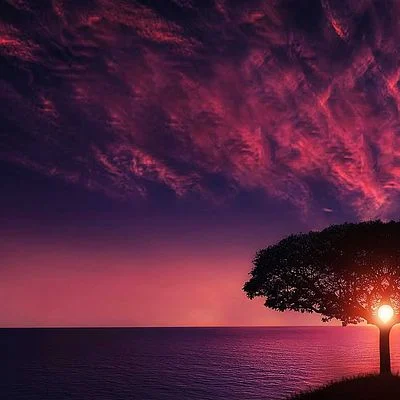

#### [Grayscale](filters/grayscale_filter.cpp) (-gs)
Converts the image to grayscale using the formula


Command: `-gs`
Result:

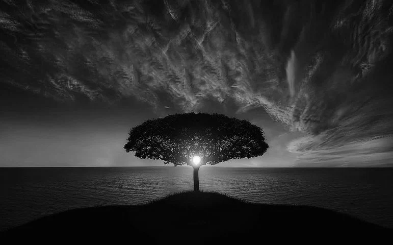

#### [Negative](filters/negative_filter.cpp) (-neg)
Converts an image to a negative using the formula


Command: `-neg`
Result:

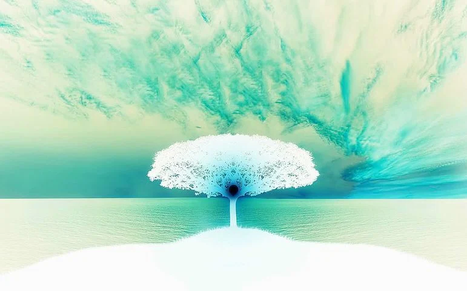

#### [Sharpening](filters/sharp_filter.cpp) (-sharp)
Sharpening. It is applied by using a matrix


Command: `-sharp`
Result:

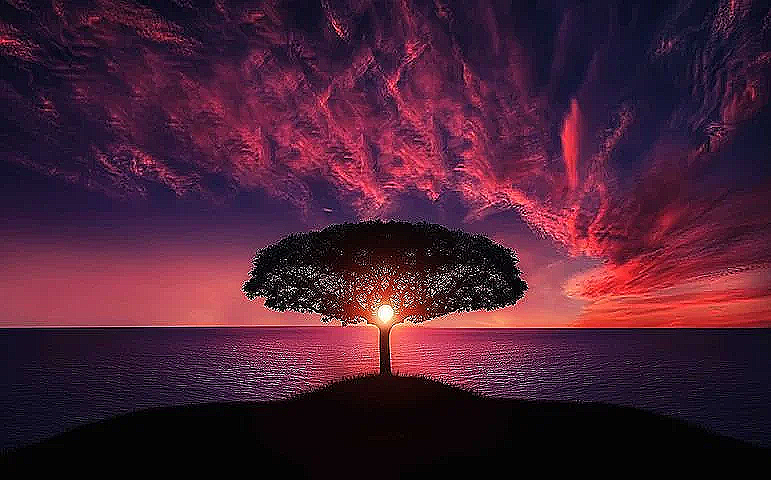

#### [Edge Detection](filters/edge_detection_filter.cpp) (-edge threshold)
Border selection. The image is converted to grayscale and a matrix is applied


Pixels with a value exceeding the threshold are colored white, the rest are black.

Command: `-edge 15`
Result:

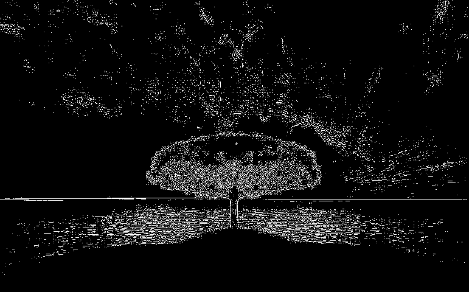

#### [Gaussian Blur](filters/gaussian_blur.cpp) (-blur sigma)
[Gaussian blur](https://ru.wikipedia.org/wiki/Blurry_gaussu),
the parameter is sigma.

The value of each of the pixel colors `C[x0][y0]` is determined by the formula


Command: `-blur 3`
Result:


#### [Crystallize](filters/crystallize_filter.cpp) (-crystallize points_amount)
This filter turns picture into set of crystalls with the same color, the parameter is the amount of crystalls.

It works like this: first, an array of random points of a given size is created, after that the value of each pixel turns into the value of the closest pixel from our array. That is how it works.

Command: `-crystallu
ize 2000`
Result:

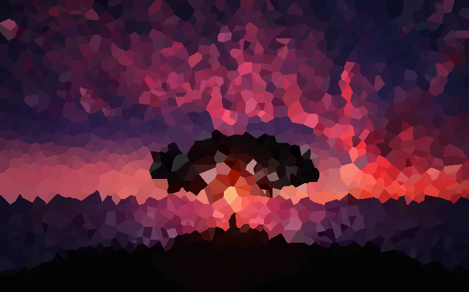

#### [Crystallize advanced](filters/crystallize_advanced_filter.cpp) (-crystallize_advanced points_amount)
Advanced version of the previous one, but here the value of pixel turns into a weighted sum of two closest points with the weights proportional to the default distanses between the points.

Command: `-crystallize_advanced 2000`
Result:

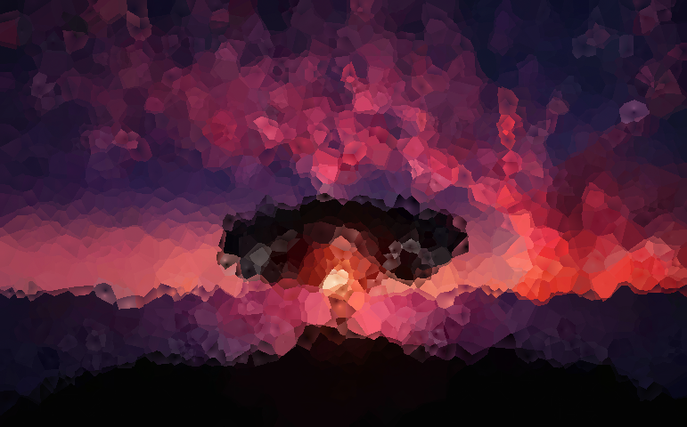

#### Some filter combinations

Command: `-crystallize_advanced 2000 -gs`
Result:

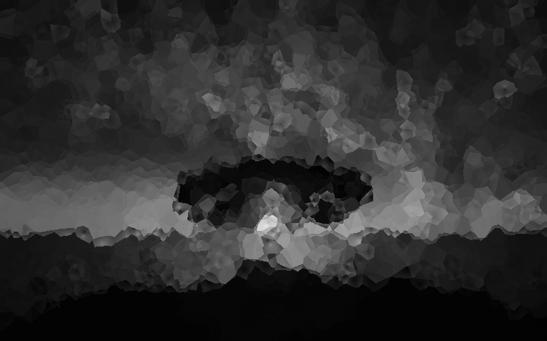


Command: `-sharp -edge 15`
Result:

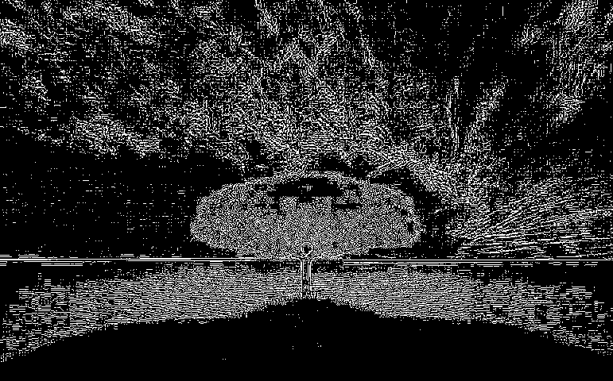


Command: `-sharp -gs`
Result:

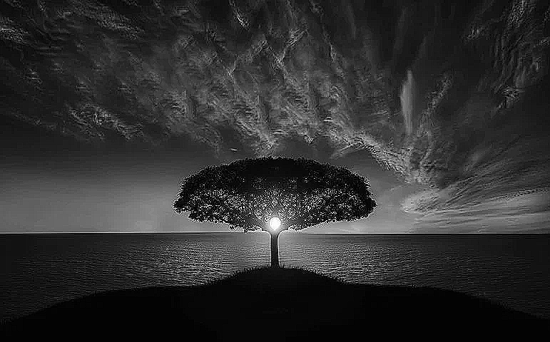
